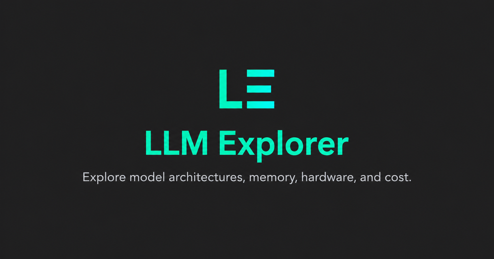

# LLM Explorer

<p align="center">
  <strong>Understand the model. Size the workload. Choose the hardware.</strong>
</p>

<p align="center">
  <a href="https://github.com/isEmmanuelOlowe/llm-explorer/actions/workflows/lint.yml"></a>
  <a href="https://github.com/isEmmanuelOlowe/llm-explorer/actions/workflows/nextjs.yml"></a>
  <a href="LICENSE"></a>
</p>

<p align="center">
  <a href="https://isemmanuelolowe.github.io/llm-explorer/"><strong>Open the live explorer →</strong></a>
</p>



LLM Explorer is a static, source-backed workspace for inspecting modern language-model architectures and turning them into defensible deployment estimates. It connects Hugging Face evidence to an interactive architecture graph, memory composition, hardware fit, throughput ceilings, and verified cloud pricing without downloading checkpoints or executing remote model code.

## What it answers

1. **How is this model built?** Inspect attention, residual, dense/MoE, multimodal, and output paths inside one repeated transformer block.
2. **What consumes memory?** Separate weights, activations, KV/recurrent state, optimiser state, and framework overhead.
3. **Will it fit?** Compare required memory with per-device and aggregate topology constraints across NVIDIA, AMD, Intel, and Apple hardware.
4. **What might it deliver?** Estimate decode throughput from the lower of compute and memory-bandwidth ceilings.
5. **What will the selected GPU cost?** Show a cloud rate only when a dated provider offering maps to that exact hardware—or accept an explicit custom quote.

## Highlights

- **Diagram-first architecture explorer** with overview and inside-one-block modes, draggable nodes, adjacent tensor/component detail, compact repeated-layer notation, and semantic zoom.
- **Pinned Hugging Face inspection** using immutable revisions, `config.json`, model metadata, bounded safetensors header requests, and linked Transformers implementations.
- **Architecture-aware caching** for GQA/MQA, local/global attention schedules, compressed attention, and recurrent/state-space layers.
- **Inference and training memory models** with weight format, KV precision, concurrency/batch size, optimiser, and explicit overhead controls.
- **Topology-aware hardware matching** across individual accelerators, unified-memory systems, and multi-device platforms.
- **Current source-backed catalogs** with vendor URLs, checked dates, precision labels, topology notes, and cloud-rate provenance.
- **LABIIUM themes** with shared System, Paper, Obsidian, and Photonic appearances and a persisted cross-property preference.
- **Static and privacy-preserving**: deployable to GitHub Pages with no backend, token collection, checkpoint download, or arbitrary Python execution.

## Accuracy model

The interface labels exact arithmetic, sourced evidence, and estimates separately.

| Output                             | Classification                     | Basis                                                            |
| ---------------------------------- | ---------------------------------- | ---------------------------------------------------------------- |
| Weight memory                      | Exact arithmetic                   | Parameter count × selected storage precision                     |
| Standard KV cache                  | Exact arithmetic                   | Layers × KV heads × head dimension × precision × resident tokens |
| Typed hybrid/state cache           | Architecture-aware arithmetic      | Source-backed layer schedules and state definitions              |
| Cloud cost                         | Exact arithmetic over a dated rate | Exact selected-GPU mapping or explicit custom quote × runtime    |
| Activations and framework overhead | Estimate                           | Runtime-dependent heuristics                                     |
| Throughput and latency             | Estimate                           | Compute and bandwidth roofline ceilings, not a benchmark         |
| Hardware fit                       | Estimate                           | Capacity/topology screening; runtime placement still matters     |

## Quick start

Requirements: Node `24.14.1+` and npm `11.11.0+`.

```bash
git clone https://github.com/isEmmanuelOlowe/llm-explorer.git
cd llm-explorer
npm ci
npm run dev
```

Open [http://localhost:3000](http://localhost:3000). The default workspace uses `google/gemma-4-12B` with a long-context inference workload; select a curated preset or enter another public Hugging Face model ID.

Public repositories are inspected in the browser. Gated/private repositories are reported as unavailable rather than requesting a token in a public client.

## Source-backed catalogs

Generated catalogs are committed as reproducible snapshots so the deployed application remains a static export.

```bash
npm run refresh:catalogs        # refresh model and GPU snapshots
npm run generate:model-catalog  # pinned Hub/config/safetensors metadata
npm run generate:gpu-catalog    # validate and copy hardware sources
npm run verify:catalogs
```

Hardware entries include checked dates, vendor references, memory topology, bandwidth, and precision-qualified compute fields. Cloud prices include provider links and billing assumptions; rates and capacity can change, so the UI preserves the verification date and current-source link.

## Verification

```bash
npm run format:check
npm run lint:strict
npm run typecheck
npm test -- --runInBand
npm run validate:math
npm run verify:catalogs
npm run build
npm run verify:export
```

The test suite covers estimator arithmetic, hybrid cache schedules, model metadata, graph layout and interaction, GPU grouping/catalog integrity, exact cloud-price matching, themes, and static asset paths.

## Deployment

The project uses Next.js Pages Router with `output: 'export'`. `.github/workflows/nextjs.yml` publishes `master` to GitHub Pages.

Production configuration is repository-name-safe:

```text
NEXT_PUBLIC_SITE_URL=https://<owner>.github.io
NEXT_PUBLIC_BASE_PATH=/<repository>
```

The workflow derives both values from GitHub, so canonical URLs, sitemap entries, fonts, favicons, and static assets continue to work under the repository Pages path.

## Security and data boundaries

- Remote Python and custom Transformers code is linked for review but never imported or executed.
- Safetensors fallback inspection uses bounded HTTP range requests instead of downloading weight files.
- No Hugging Face token is collected by the static public client.
- Multi-GPU aggregate capacity is not presented as automatically contiguous memory; runtime parallelism and interconnect support must still be validated.

## Contributing

Contributions that improve model coverage, hardware/pricing provenance, estimator math, accessibility, or diagram usability are welcome. Keep generated catalog changes paired with their source overrides and verification output.

## License

See [LICENSE](LICENSE).
